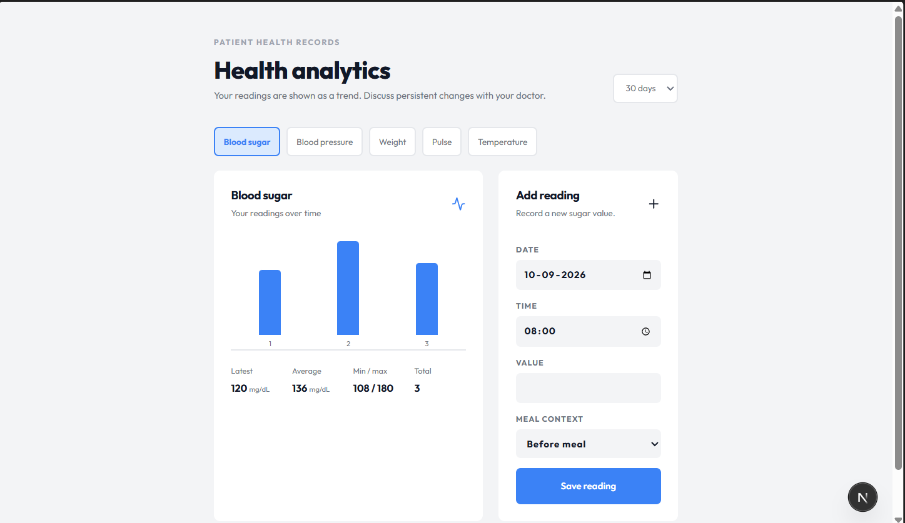
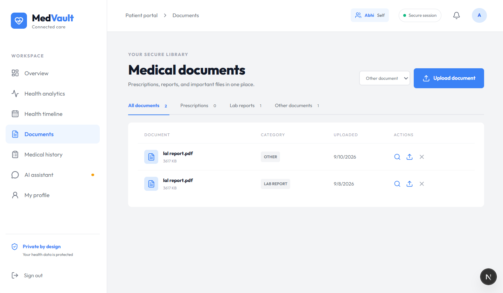
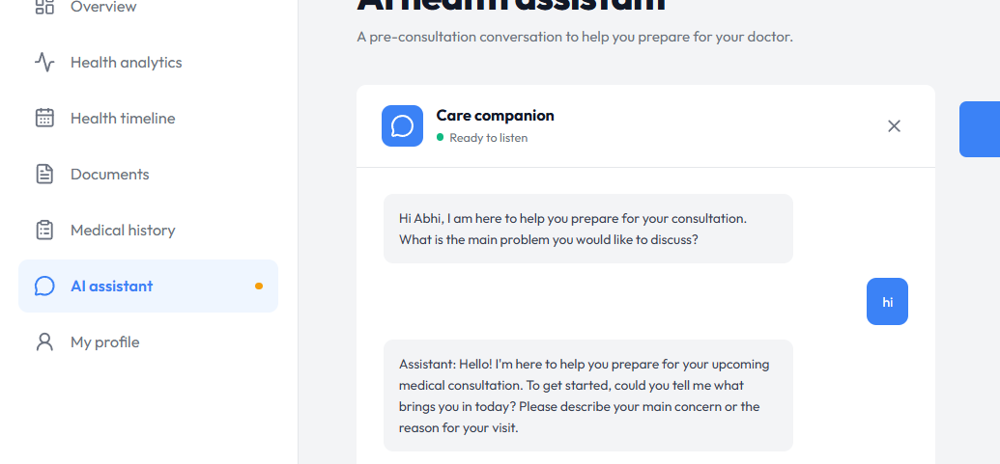
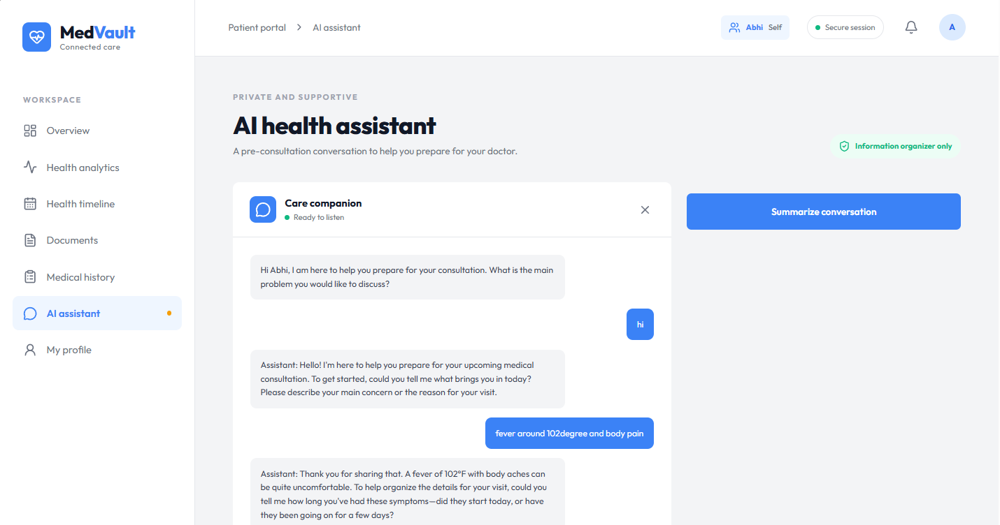

# MedVault — Connected Care

Smart India Hackathon 2026 submission.

## 1. Project Information

- **Project Title:** MedVault — Connected Care
- **Problem Statement ID:** SIH-26047
- **Problem Statement Title:** patient case taking software
- **Theme:** MedTech / BioTech / HealthTech
- **Team Name:** SwayasthaID
- **Live Demo:** 

## 2. Problem Statement

Healthcare data is fragmented across paper prescriptions, lab reports, and multiple family members' records. Patients arrive at consultations without a consolidated medical history, chronic-condition readings (sugar, BP) are tracked informally or not at all, and medicine schedules are missed. Doctors lose consultation time reconstructing history instead of treating.

## 3. Proposed Solution

MedVault is a family-centric digital health hub that consolidates:

- A secure **document vault** for prescriptions, lab reports, and scans
- **Health analytics** for chronic-condition readings with trend visualization
- A **medicine tracker** with schedules
- A **medical history timeline** per family member
- An **AI assistant** that answers health-record questions and generates a structured **pre-consultation summary** the patient can share with the doctor before the visit

## 4. Key Features

| Feature | Description |
| --- | --- |
| Family profiles | One account manages multiple family members |
| Document vault | Upload, categorize, and download medical documents (PDF/images) |
| Health analytics | Log sugar/BP/weight readings and view trends |
| Medicine tracker | Track medicines, dosage, and schedules |
| Medical history | Timeline of conditions, surgeries, allergies |
| AI assistant | Chat over your records; generates pre-consultation summaries |
| Secure auth | bcrypt password hashing, httpOnly session cookies |

## 5. Technology Stack

- **Frontend:** Next.js 16 (App Router), React 19, Tailwind CSS 4, lucide-react
- **Backend:** Next.js API routes (REST)
- **Database:** Prisma 7 (schema-ready; JSON file store for demo)
- **File storage:** Vercel Blob (production) / local uploads (dev)
- **AI:** OpenAI-compatible LLM API (gpt-4o-mini default)
- **Auth:** bcryptjs + signed httpOnly session cookie
- **Hosting:** Vercel

## 6. Architecture

See [docs/architecture.md](docs/architecture.md) for the full architecture diagram and component breakdown.

## 7. Repository Structure

```
sihh-app/
├── src/                  # Application source code
│   ├── app/              # Next.js App Router pages + API routes
│   ├── components/       # React components
│   └── lib/              # auth, store, storage, prisma helpers
├── docs/                 # Architecture and design docs
├── assets/screenshots/   # Application screenshots
├── submission/           # Final PPT and demo video links
├── prisma/               # Database schema
├── data/                 # Local JSON data store (demo)
└── LICENSE
```

## 8. Final Presentation

See [submission/PRESENTATION.md](submission/PRESENTATION.md).

## 9. Demo Video

See [submission/DEMO.md](submission/DEMO.md).

## 10. Screenshots

| Screenshot | |
| --- | --- |
| Dashboard |  |
| Health Analytics |  |
| Medicines |  |
| Document Vault |  |

More in [assets/screenshots/](assets/screenshots/).

## 11. Installation

```bash
git clone https://github.com/abhisheksharmaug25-ship-it/sihh-app.git
cd sihh-app
npm install
cp .env.example .env   # fill in values
```

Required environment variables (see `.env.example`):

| Variable | Purpose |
| --- | --- |
| `SESSION_SECRET` | Random secret for session signing |
| `LLM_API_KEY` | API key for the LLM provider |
| `LLM_BASE_URL` | LLM API base URL |
| `LLM_MODEL` | Model name (e.g. `gpt-4o-mini`) |
| `BLOB_READ_WRITE_TOKEN` | Vercel Blob token (production uploads) |
| `DATABASE_URL` | Database connection string |

## 12. Run

```bash
npm run dev

```

Production build:

```bash
npm run build && npm start
```

## 13. Future Scope

- Migrate the demo JSON store to managed Postgres via Prisma
- OCR + AI extraction of data from uploaded prescriptions
- Doctor-facing portal for shared pre-consultation summaries
- Medicine reminders via WhatsApp/SMS
- ABHA (Ayushman Bharat) health ID integration
- Mobile app (React Native)

## Team

| Name | Role | GitHub |
| --- | --- | --- |
| _(add member)_ | _(role)_ | _(handle)_ |

## License

MIT — see [LICENSE](LICENSE).
